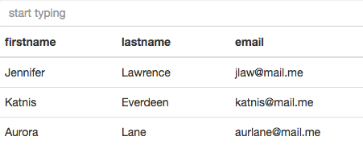

# json-grid-react

A simple react component which converts the JSON object into a grid/table.

# Installation
Clone this repository by
```
git clone https://github.com/jayendra-sharan/json-grid-react.git
cd json-grid-react
npm install
```

# Instructions
To run the application ```npm start```

This application is made with create-react-app, so you can use all those commands
which are provided by them.

For more information visit:
[Create React App](https://github.com/facebookincubator/create-react-app)

# Usage
```
let data = [
    {
      'firstname': 'Jennifer',
      'lastname': 'Lawrence',
      'email': 'jlaw@mail.me'
    },
    {
      'firstname': 'Katnis',
      'lastname': 'Everdeen',
      'email': 'katnis@mail.me'
    },
    {
      'firstname': 'Aurora',
      'lastname': 'Lane',
      'email': 'aurlane@mail.me'
    }
  ];
let root = document.querySelector('#root');

// JSONgrid can be nested within any other components of your choice.

ReactDOM.render(
  <JSONgrid filter={true} responsive={false} className='table' data={data}  />,
  root
)
```

# Result [screenshot]



# Props used with JSONgrid

Props | Type | isMandatory | Accepts | Description
--- | --- | --- | --- | ---
**filter** | Boolean | No | `true` or `false` | Adds a filter text box to filter items.
**responsive** | Boolean | No | `true` or `false` | Makes the result (grid/table) responsive.
**className** | string | No |	Any valid css class |	Adds the relevant style to the grid/table.
**data** | Array of Object | Yes | Array of Object (see example above) | Data used for creating grid/table.

# Feature
You can sort the data in ascending or descending order by clicking on the header.

# Important Note
It is mandatory to provide array simple objects. Nested object will not work as colspan/rowspan has not been implemented. This component assumes the data to be string. If conversion needed, you might have to change the code. Let me know if help is needed.
